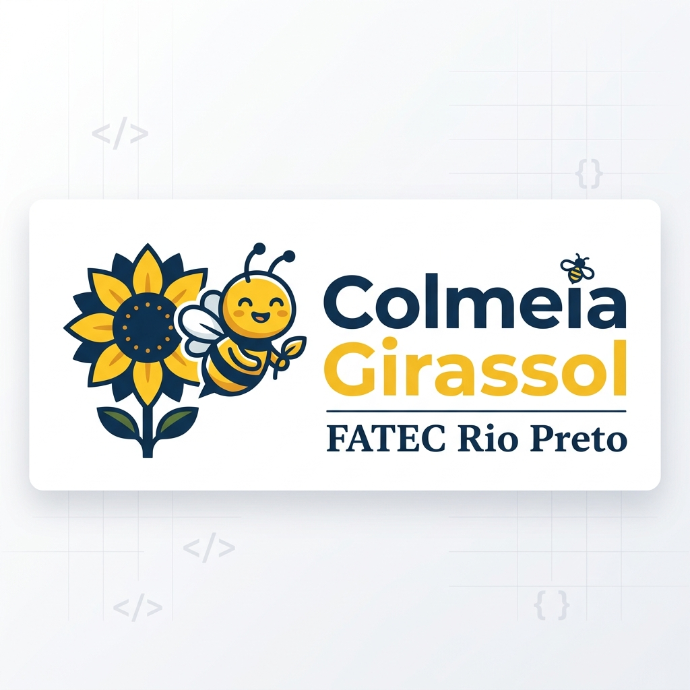

  

# 🐝 Colmeia Girassol - Sistema de Gestão Escolar Infantil

Este projeto é um sistema de gestão para escolas infantis desenvolvido como parte integrante das atividades acadêmicas da **FATEC Rio Preto**. A **Colmeia Girassol** visa modernizar a comunicação entre escola e família, além de otimizar a gestão administrativa e pedagógica.

---

## 🎓 Contexto Acadêmico
*   **Instituição:** Faculdade de Tecnologia de São José do Rio Preto (FATEC Rio Preto)
*   **Período:** 3º Semestre
*   **Disciplinas Integradas:**
    *   **Linguagem de Programação I (LP1):** Implementação de toda a lógica de negócio em Java, utilizando conceitos de Orientação a Objetos (Herança, Polimorfismo, Encapsulamento).
    *   **Engenharia de Software:** Modelagem do sistema, levantamento de requisitos e estrutura de navegação baseada em perfis de usuário.
    *   **Banco de Dados:** Modelagem e estrutura de persistência de dados (simulada via instanciamento programático e objetos estruturados).
*   **Objetivo:** Desenvolvimento de uma aplicação Full-Stack integrando lógica em Java com interface Web responsiva.

---

## 🚀 Sobre o Projeto
O sistema foi projetado para atender três pilares fundamentais de uma instituição de ensino:

1.  **Administração:** Gestão de professores, turmas, alunos e matrículas.
2.  **Corpo Docente:** Registro de presença, diários de bordo (humor, alimentação, sono) e planejamento de atividades.
3.  **Família:** Acompanhamento em tempo real da rotina escolar, visualização de diários e informações sobre o desenvolvimento da criança.

---

## ✨ Funcionalidades Principais (Demo Version)

### 🛠️ Painel Administrativo
- Visualização de indicadores gerais (total de alunos, professores, etc).
- Cadastro simulado de novos professores e turmas com validação.
- Gestão de matrículas vinculando alunos a responsáveis.
- **Segurança:** Sistema de proteção de dados para demonstração (exclusão desativada).

### 👨‍🏫 Painel do Professor
- Navegação fluida entre seções (Início, Planejamento, Minha Turma).
- Lista de presença interativa por planejamento de aula.
- **Consulta de Autorizados:** Visualização instantânea de quem pode buscar o aluno na escola (com foto e documento).
- Lançamento de Diário de Bordo simplificado.

### 🏠 Painel do Responsável
- Acompanhamento diário das atividades e bem-estar do aluno.
- Visualização de dados cadastrais e financeiros.

---

## 🛠️ Tecnologias Utilizadas

### **Back-end (Java Core)**
- Programação Orientada a Objetos (POO).
- Arquitetura baseada em Entidades (Aluno, Professor, Turma, etc).
- Sincronização de dados via instanciamento programático (10 instâncias de cada entidade).

### **Front-end (Web)**
- **HTML5 & CSS3:** Design moderno, responsivo e com foco em experiência do usuário (UX).
- **JavaScript (Vanilla):** Lógica de Single Page Application (SPA) para navegação sem recarregamento.
- **Bootstrap 5:** Framework para componentes visuais elegantes e grids responsivos.
- **AOS (Animate On Scroll):** Animações suaves para uma apresentação impactante.

---

## 📂 Estrutura de Pastas
- `src/`: Código fonte das entidades e lógica em Java.
- `web/`: Interface do usuário (HTML, CSS e JavaScript).
- `img/`: Ativos visuais e ícones do projeto.

---

## ⚙️ Como Executar a Demo
1.  Abra a pasta `web/html/login.html` em qualquer navegador moderno.
2.  Utilize os dados de demonstração (ex: Prof. Marcos Silva ou Aluno Joãozinho) para navegar pelos painéis.
3.  O sistema opera em **Modo Demonstração Visual**, garantindo que os dados base permaneçam íntegros durante toda a apresentação.

---

© 2026 Colmeia Girassol - Projeto Acadêmico FATEC Rio Preto.
